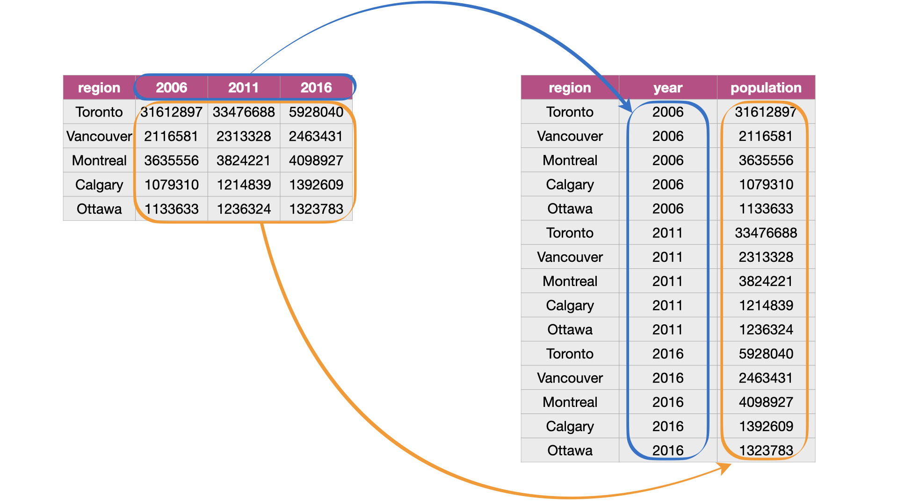

# Cobertura del servicio de internet de Entel

El presente repositorio muestra el proceso de preparación y transformación de datos del documento en pdf referente a la cobertura a nivel nacional del servicio de internet de Entel por distrito.  

Para ello la data se obtuvo del [siguiente enlace ](https://www.entel.pe/wp-content/uploads/2022/11/listado-ccpp-con-cobertura-movil-3Q2022.pdf) y que corresponde a noviembre del 2022. Este documento en pdf debe ser descargado, preparado en csv y luego transformado para poder visualizarlo en un gráfico.

## Preparación
La data que está en formato pdf debe convertirse a **csv** para poder manipularlo. Los pasos para la conversión son:

a. Abrir el pdf en word

b. Cambiar todos los "X" por "si" y las "/" por ";".

c. Copiar la tabla y llevarla a excel.

d. Manualmente arreglar algunas inconsistencias que se presentan al desactivar la union de celdas. 

e. Guardar el resultado como csv en la carpeta **"data/cobertura_movil_3Q2022.csv"**

## Transformación
Los datos preparados no resultan convenientes para la visualización. Antes es necesario convertirlo de pivot a long format, usando el siguiente [script](https://github.com/ccalobeto/cobertura_internet/blob/master/parser_internet_coverage.ipynb) de python. 

### Ejemplo de la transformación

La salida de este script en python es el archivo transformado **data/entel_movil_parsed.csv**